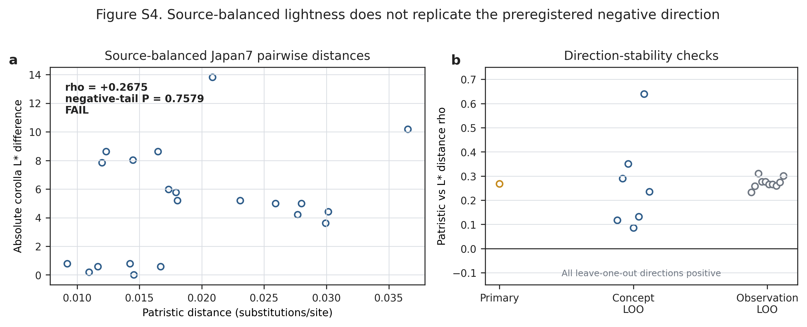

# Supporting Information for Chapter 2 JEB submission

## Article

**Present-day phenotypic integration does not imply a shared evolutionary history in a rapid thistle radiation**

This Supporting Information reports the admission decisions, complete sensitivity families and negative controls underlying the main article. It preserves scientific `FAIL`, `not_evaluable`, identity warnings and the distinction between substitutions per site and absolute time.

## Supplementary figures

**Figure S1. Frozen Japan38 Comp1061 phylogram and admission exceptions.** The accepted compatibility tree was reconstructed from 236 of 241 loci passing sequence-quality checks, of which 176 were rootable, with 1,000 ultrafast bootstrap replicates. Branch lengths are substitutions per site and do not represent absolute time. The two JPN20 samples are biological samples and were not collapsed; they were non-monophyletic in the maximum-likelihood tree and in all 1,000 bootstrap trees. JPN31 was excluded from primary trait-history analyses because its accepted taxonomic identity did not support the planned phenotype join. JPN29 remains in the raw tree and original frozen eight-concept analysis, but an identity/provenance warning prohibits a clean Japanese phenotype-tip interpretation; the fixed JPN29-excluded panel is therefore reported as a sensitivity, not as a confirmatory rescue.

**Figure S2. Continuous state-structure estimates and leave-one-concept-out ranges.** Points show Spearman correlations between patristic and trait distances; horizontal lines show leave-one-concept-out ranges. The original frozen families contain eight traits at both the >=2- and >=5-observation thresholds and every row is `two_sided_not_supported` after family correction. The fixed JPN29-excluded sensitivity retains eight `two_sided_not_supported` rows at >=2 observations. Its >=5 family is `not_evaluable` because five eligible concepts are fewer than the frozen minimum of six; it is not plotted as a zero effect.

**Figure S3. Equal-branch continuous topology diagnostic.** Thin lines show minima and maxima, thick lines the 5th–95th percentiles, white bars the 25th–75th percentiles, circles the medians and diamonds the maximum-likelihood values across 1,000 trees. The mean cross-trait branch-change correlation was positive in 1,000/1,000 topologies (median rho=0.141287, q05=0.118995). This display is diagnostic only: it includes JPN29 and does not supply a reconstruction-aware null separately for each topology, so it cannot support the main shared-localization claim.

**Figure S4. Source-balanced lightness non-replication.** In the seven-concept Japanese panel, pairwise source-balanced corolla-lightness differences were positively rather than negatively related to patristic distance (rho=0.2675; exact predeclared negative-tail P=0.7579; `FAIL`). All seven-concept and sparse-observation leave-one-out estimates remained positive. This bounded non-replication prevents the earlier global/high-depth negative direction from being promoted as a Japanese-radiation history.

**Figure S5. Species-tip compression in one morph-linked system.** For the one testable *Cirsium japonicum* var. *takaoense* system, the species-tip tree permits a minimum of one colour-state change whereas the population-aware sensitivity permits a minimum of two. The evidence ladder supports state-compression sensitivity in 4/4 tests, a bounded genealogy statement in 1/4, and a replicated rate statement in 0/4. This is a single-system information-resolution result, not a general rate estimate or proof of regain.

## Supplementary tables

**Table S1. Special tree, concept and phenotype-join admissions.** Ordinary admitted concepts follow the frozen tree-tip and phenotype crosswalk; the rows below are all exceptions that change interpretation.

| Layer or concept | Scope | Admission status | Claim boundary |
| --- | --- | --- | --- |
| Comp1061 tree | 39 ingroup samples representing 38 paper concepts | Accepted compatibility phylogram: 236/241 loci passed sequence QC; 176 were rootable; 1,000 UFBoot trees | Branch length is substitutions/site, not absolute time |
| JPN20 | Two biological sequence samples for one paper concept | Both tips retained; not collapsed; non-monophyletic in ML and 0/1,000 UFBoot trees supported monophyly | Cannot be treated as one interchangeable sequence sample |
| JPN31 | One sequence sample | Excluded from primary trait history | No phenotype-tip value or inferred absence may be manufactured |
| JPN29 | Raw-tree tip and original eight-concept continuous panel | Retained in the original frozen analysis with identity/provenance warning; excluded only in the fixed sensitivity | No clean Japanese phenotype-tip interpretation; sensitivity cannot replace the original result |
| Continuous phenotype bridge | Fourteen paper concepts with at least one eligible measurement | Admitted as global species-level image proxies | Values are not measurements of the sequenced Japanese vouchers or populations |

**Table S2. Complete continuous state-structure families.** Family correction was conducted separately within each frozen threshold and sensitivity family.

| Analysis family | Threshold | Evaluable concepts | Trait units tested | Supported after family correction | Status |
| --- | ---: | ---: | ---: | ---: | --- |
| Original frozen panel | >=2 observations | 14 maximum, trait-specific | 8 | 0 | 8/8 `two_sided_not_supported` |
| Original frozen panel | >=5 observations | 8 maximum, trait-specific | 8 | 0 | 8/8 `two_sided_not_supported` |
| Fixed JPN29-excluded sensitivity | >=2 observations | 13 maximum, trait-specific | 8 | 0 | 8/8 `two_sided_not_supported` |
| Fixed JPN29-excluded sensitivity | >=5 observations | 5 | 0 | 0 | `not_evaluable`: below frozen minimum of 6 concepts |

**Table S3. Reconstruction-aware continuous nulls.** The observed statistic is the mean cross-trait Spearman correlation of branchwise absolute changes. Null draws reconstruct independently permuted tip values on the same branch geometry.

| Panel | Concepts / branches | Observed mean rho | Null median | Null q05–q95 | One-sided P | Decision |
| --- | ---: | ---: | ---: | ---: | ---: | --- |
| Original frozen panel | 8 / 14 | 0.408006 | 0.380220 | 0.272684–0.497363 | 0.3504 | `FAIL` |
| Fixed JPN29-excluded provenance sensitivity | 7 / 12 | 0.472278 | 0.415335 | 0.315435–0.525974 | 0.1959 | `FAIL` |

The sensitivity cannot replace the original analysis or be treated as a confirmatory rescue.

**Table S4. Discrete recurrence, roots and placement.** Counts are unordered-parsimony lower bounds, not counts of independent origins.

| Trait | Resolved concepts | ML minimum | UFBoot range | Root boundary | Placement example |
| --- | ---: | ---: | ---: | --- | --- |
| Orientation | 20 | 6 | 4–6 | ML root upward/erect | No individually forced ML edge; JPN36 terminal fraction 0.201 |
| Phyllary posture | 10 | 3 | 3–3 | Root posture ambiguous | JPN36 terminal fraction 0.754 |
| Stickiness | 13 | 5 | 5–5 | ML root sticky | Placement remains partial; JPN06 0.67 and JPN36 0.40 in the placement audit |

**Table S5. Discrete transition-overlap sensitivity.** Correlations compare branchwise transition burdens on equal-branch trees.

| Pair | Equal-branch topologies | Median rho | q05 | q95 | Fraction positive |
| --- | ---: | ---: | ---: | ---: | ---: |
| Orientation–phyllary | 969 | -0.059394 | -0.205883 | 0.200870 | 0.3488 |
| Orientation–stickiness | 1,000 | -0.387012 | -0.391988 | -0.186939 | 0.0090 |
| Phyllary–stickiness | 969 | 0.183990 | -0.073454 | 0.257679 | 0.7823 |

No pair supplies a topology-robust, consistently positive shared-transition history.

<PAGEBREAK>

**Table S6. Stop rules and claim boundaries.** These decisions are part of the result and must not be silently repaired after outcome inspection.

| Analysis or evidence layer | Frozen decision | Boundary retained in this submission |
| --- | --- | --- |
| Absolute-time analysis | `STOP_NOT_IDENTIFIABLE` | No defensible multi-anchor calibration; tree remains a substitutions/site phylogram |
| Candidate continuous involucre/armature endpoints | Coverage only | Two eligible concepts cannot support continuous-history inference |
| Original reconstruction-aware shared-change null | `FAIL`, P=0.3504 | No coordinated continuous remodeling claim |
| Fixed JPN29-excluded sensitivity | `FAIL`, P=0.1959 | No sensitivity rescue or clean original tip interpretation |
| Japan7 lightness replication | `FAIL`, exact negative-tail P=0.7579 | No Japanese-radiation lightness conservatism claim |
| Species-tip compression | One morph-linked system only | No general rate, regain or radiation-wide genealogy claim |

## Machine-readable sources

- `data/evidence/chapter2_time_axis_compute/continuous_primary_phylogenetic_structure_v1.csv`
- `data/evidence/chapter2_time_axis_compute/japan38_branch_change_reconstruction_null_v1.json`
- `data/evidence/chapter2_time_axis_compute/japan38_continuous_branch_change_topology_sensitivity_v1.json`
- `data/evidence/chapter2_time_axis_compute/japan38_latest_module_overlap_topology_sensitivity_v2.json`
- `data/evidence/chapter2_provenance_sensitivity_compute/continuous_primary_phylogenetic_structure_v1.csv`
- `data/evidence/chapter2_provenance_sensitivity_compute/japan38_all_continuous_history_summary_v1.json`
- `data/evidence/chapter2_provenance_sensitivity_compute/japan38_branch_change_provenance_sensitivity_v1.json`
- `data/evidence/japan7_source_balanced_lightness_compute/japan7_source_balanced_lightness_history_v1.json`
- `analysis/chang2026_takaoense_topology_uncertainty_summary.json`

## File and claim audit

- [x] all five supplementary figures have alternative text;
- [x] every table is cross-checked against frozen machine-readable sources;
- [x] original and JPN29-excluded analyses are visibly distinguished;
- [x] scientific `FAIL` and `not_evaluable` are explicit;
- [x] no minimum step is called an independent origin, convergence or adaptation;
- [x] no substitutions/site branch is called absolute time;
- [x] no global species proxy is called a sequenced-voucher phenotype.
