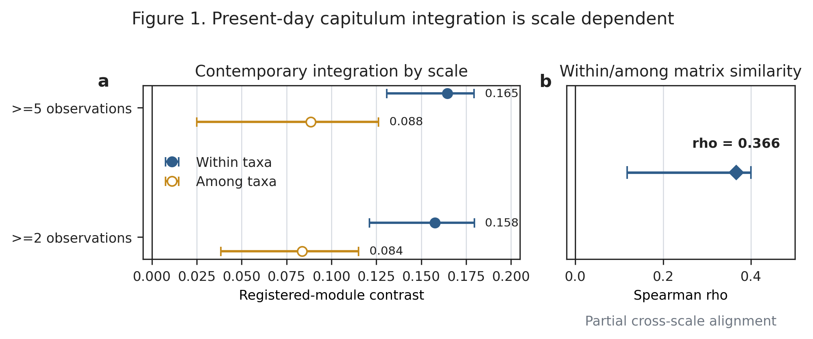

# Present-day phenotypic integration does not imply a shared evolutionary history in a rapid thistle radiation

**Target journal:** *Journal of Evolutionary Biology* — Research Article  
**Manuscript status:** active double-anonymous submission draft v3; supersedes v1/v2 for submission  
**Running title:** Scale-dependent capitulum integration  
**Word-limit contract:** main text <=7,500 words; abstract <=250 words; 4–10 keywords

## Abstract

Phenotypic integration is measured from covariation among present-day traits, but its persistence through evolutionary history cannot be assumed. We projected one continuous phenotype ontology from contemporary observations onto a nuclear phylogeny of a rapid Japanese *Cirsium* radiation. Registered capitulum modules were more strongly expressed within taxa than among taxa, establishing scale-dependent present-day integration. We then separated three historical estimands: phylogenetic structure of continuous states, minimum recurrence of independently defined discrete states, and shared localization of reconstructed change. None of eight continuous orientation, colour and shape dimensions showed robust phylogenetic state structure in the sparse exact-concept panel. Orientation required four to six minimum changes across 1,000 bootstrap topologies, whereas phyllary posture required three and stickiness five. Stable recurrence counts did not imply equally stable transition placement: no orientation edge was individually forced on the maximum-likelihood tree, while one terminal phyllary change was forced in 75.4% of bootstrap topologies. Apparent positive coupling among reconstructed continuous changes was compatible with a null that independently permuted tip labels and repeated ancestral reconstruction (eight-concept P=0.3504). A pre-frozen exclusion of one identity-unresolved concept gave the same decision (seven-concept P=0.1959). Discrete transition-overlap estimates were likewise sensitive to topology and branch-length treatment. Thus, contemporary integration, recurrence counts and shared historical localization are distinct properties. Present-day capitulum modules do not currently support one persistent historical module, without implying evolutionary independence, convergence or adaptation.

**Keywords:** *Cirsium*; capitulum; phenotypic integration; phylogenetic signal; phenomics; rapid radiation; trait recurrence; topology uncertainty

---

# Introduction

Organisms evolve as multivariate phenotypes. Components of a complex structure can covary because of shared development, genetics, function or selection, and this integration can bias the directions in which variation is produced and retained. Conversely, modular organization can permit subsets of a phenotype to vary with partial independence. These ideas have motivated extensive work on floral integration and on the macroevolution of complex structures (Bissell & Diggle, 2010; Klingenberg, 2014; Goswami et al., 2014). Yet modularity is not one estimand, and conclusions depend on the biological scale and property being measured (Zelditch & Goswami, 2021).

One distinction is central to comparative biology: present-day covariance is not itself a shared evolutionary history. Contemporary trait associations can differ within and among taxa, and neither scale determines whether trait states are phylogenetically retained. Likewise, repeated categorical states do not determine which branches changed, and correlated ancestral reconstructions can arise from common phylogenetic geometry rather than coordinated biological change. Morphological integration can shape disparity without mapping simply onto evolutionary rate, while mosaic evolution can produce component-specific histories within one structure (Goswami et al., 2014; Felice & Goswami, 2018). Floral systems add within-individual and within-population variation to these scale distinctions (Diggle, 2014).

We therefore separate four properties that are often compressed under phenotypic integration. **Present integration** asks how strongly traits covary in contemporary observations and whether that association is similar within and among taxa. **State structure** asks whether relatives retain similar continuous trait values. **Recurrence** asks for the minimum number of changes required by independently defined categorical states. **Change localization** asks whether different traits place relatively large changes, or discrete transitions, on the same branches. These properties may agree, but agreement is an empirical result rather than a premise.

Rapid radiations provide a stringent test because considerable phenotype diversity is compressed into a shallow and often uncertain phylogenetic history. The thistle genus *Cirsium* offers such a system. A phylogenomic analysis of 299 plants from 251 taxa reconstructed rapid Pleistocene radiations in Japan and North America (Moreyra et al., 2025). Thirty-six of 38 sampled Japanese taxon concepts occurred in one dominant radiation, while phylogenomic discordance implicated processes including incomplete lineage sorting and hybridization. Trait-history inference in this system must therefore propagate topology uncertainty and avoid equating a minimum change with an independently evolved adaptation.

A companion phenomic programme quantified capitulum orientation, corolla colour, outline shape and related measurements from georeferenced images. Registered measurement modules were detectable within taxa but weaker among taxa, and the corresponding association matrices were only partly aligned. This provides an unusual opportunity to project the **same phenotype ontology** from contemporary biological scale onto phylogenetic history. The historical analysis does not select traits because they show environmental associations, and no image-derived measurement is assumed to have a validated ecological function.

We ask whether present-day capitulum integration persists as a shared historical pattern. First, is registered-module integration comparable within and among contemporary taxa? Second, do continuous phenotype dimensions show robust phylogenetic state structure? Third, how many changes are minimally required for independently source-coded orientation, phyllary-posture and stickiness states, and are the responsible edges identifiable? Fourth, do reconstructed continuous changes exceed a null that includes the common geometry of ancestral reconstruction? Fifth, do continuous and discrete shared-localization results survive topology and branch-length uncertainty? This ordering distinguishes a present phenotypic module from a persistent historical module and preserves negative or non-evaluable results as biological constraints.

# Materials and methods

## Study design and evidence layers

The analysis linked two frozen evidence layers. The present-day layer summarized repeated image observations and retained within-taxon and among-taxon association structure. The historical layer used an independently reconstructed Japan38 nuclear phylogeny and exact taxon-concept joins. Analysis contracts were fixed before the reconstruction-aware null and before the single JPN_29 exclusion sensitivity. Missing observations were not imputed, taxon identities were not broadened to increase coverage, and unfavourable outcomes did not trigger endpoint or threshold changes.

## Present-day integration

The companion phenomic dataset contained 46,276 unique strict-spatial image observations and 1,018,072 long-format trait rows. It represented the capitulum with 18 continuous endpoints and registered orientation, colour, shape and involucre-related measurement modules. For each frozen observation threshold, association strength among inferential units was summarized separately within and among taxa. The registered-module contrast was the mean association for endpoint pairs in the same registered module minus the mean for pairs in different modules. Bootstrap intervals were carried forward from the frozen phenomic handoff. Spearman correlation between the upper triangles of the within- and among-taxon association matrices quantified cross-scale similarity. These are observational phenotype summaries, not genetic-module or historical-transition estimates.

## Phylogeny and taxon admission

The focal panel was based on the 38 Japanese taxon concepts of Moreyra et al. (2025). We used an independently reconstructed Comp1061 compatibility phylogeny rather than digitizing the published figure. A frozen 241-locus universe yielded 236 quality-controlled nuclear loci, 176 of which were rootable with the safflower outgroup, and a concatenated alignment of 161,654 bp. Maximum-likelihood inference used IQ-TREE 2 with ModelFinder, 1,000 ultrafast-bootstrap replicates and 1,000 SH-aLRT replicates (Kalyaanamoorthy et al., 2017; Hoang et al., 2018; Minh et al., 2020).

Branch lengths are substitutions per site, not absolute time. The two JPN_20 biological samples were non-monophyletic in the maximum-likelihood tree and in 0/1,000 bootstrap trees and were not forcibly collapsed. JPN_31 was excluded from primary trait history because public identity and locality metadata conflicted with the paper concept. JPN_29 was retained in the raw nuclear tree because the primary study deliberately labelled its Japanese voucher as *C. verutum*, but an audit found that specimen-level determination remained unresolved relative to the accepted species range. It therefore could not support a clean Japanese phenotype-to-tip interpretation. The original eight-concept continuous analysis remains reported as frozen provenance; one outcome-independent sensitivity removed only JPN_29 and could not replace or rescue that result.

## Continuous phenotype bridge

We reused the frozen output of the companion phenomic analysis. These are global species-level image proxies joined to exact taxon concepts; they are not measurements of the sequenced Japanese individuals. Matching ignored botanical author strings but preserved infraspecific rank, so a broad species record could not substitute for a named variety or subspecies. No continuous value was discretized to increase coverage.

At least one phenotype was recovered for 14 exact concepts. Eight primary historical units had sufficient coverage: vertical orientation angle; CIELAB lightness; CIELAB chroma; circular hue represented jointly by sine and cosine; outline aspect ratio; outline circularity; outline solidity; and width-profile coefficient of variation. The primary threshold required at least two observations for an endpoint-concept join and at least six concepts per analysis. A threshold of five observations was retained as a high-depth sensitivity. Candidate continuous involucre and armature endpoints had only two eligible concepts and remained a coverage audit.

## Continuous phylogenetic state structure

For each scalar unit, we estimated Pagel's lambda under a Brownian covariance model and calculated Spearman correlation between pairwise patristic distance and absolute phenotype difference (Pagel, 1999). Phenotype labels were permuted across tips to generate positive, negative and two-sided null distributions. We enumerated all permutations for panels of eight or fewer concepts and used Monte Carlo label permutations for larger panels. The two-sided family was primary; Benjamini-Hochberg correction was applied across the eight units separately at each threshold. Leave-one-concept-out results assessed direction stability. Circular hue used normalized sine/cosine vectors and chord distance rather than an arbitrarily unwrapped angle.

## Discrete recurrence and transition placement

Continuous image measurements were not converted into categorical states. A separate authority-backed ontology defined capitulum orientation, phyllary posture and involucre stickiness, with ambiguous and missing states retained as missing. Current coverage was 20, ten and 13 concepts, respectively. For the maximum-likelihood tree and every raw bootstrap topology, we calculated the unordered parsimony minimum. These are topology-conditioned recurrence lower bounds, not counts of independent origin or adaptive convergence.

We separately recorded whether each parent-child edge was forced to change across all minimum-cost assignments. The fraction of bootstrap topologies forcing a named edge quantified transition-placement identifiability. Thus a stable minimum recurrence count could coexist with uncertainty about which branch changed.

An equal-rates Mk diagnostic estimated branch-wise transition posteriors and their excess over the branch prior. Pairwise Spearman correlations asked whether two discrete traits tended to localize transitions on the same edges. The branch-length-aware maximum-likelihood result was paired with a topology-only sensitivity in which every non-root bootstrap branch was assigned length one. This removed unavailable substitution-length information rather than inventing it.

## Continuous change localization and reconstruction-aware null

The original complete primary panel contained eight concepts and eight continuous units, producing 14 parent-child branches after pruning. Scalar tips were standardized by among-tip standard deviation. Brownian conditional expected internal states were reconstructed on the maximum-likelihood phylogram. Scalar parent-child differences, or circular-hue chord differences, were divided by the square root of substitution-length branch length. The descriptive statistic was the mean of 28 pairwise Spearman correlations among the eight branch-change vectors.

Permuting already reconstructed branch values treats branches as independent and omits uncertainty shared through ancestral reconstruction. It was therefore not used for the headline inference. The reconstruction-aware null independently permuted tip labels for every scalar trait, permuted hue sine/cosine pairs together, reran the same Brownian conditional reconstruction, and recalculated the global mean correlation. We used 9,999 permutations and seed 20260827. The predeclared positive rule was one-sided P<0.05. On failure, the observed correlation remained descriptive and coordinated-remodelling language was prohibited.

After the JPN_29 identity gate was recognized, a single frozen sensitivity excluded that concept while retaining all eight endpoints, the threshold of two, the six-concept minimum, 9,999 permutations and the same seed. This gave seven common concepts and 12 branches. Either outcome had to be reported and could not replace the original eight-concept result.

## Topology diagnostics and absolute-time boundary

An earlier predeclared topology diagnostic repeated continuous reconstruction across 1,000 raw bootstrap topologies after setting every non-root branch to length one. Because this diagnostic included JPN_29 and did not generate a reconstruction-aware topology null, its sign distribution is interpreted only as estimator stability, not as independent biological support.

We did not force a dated trait tree. A prior calibration audit found no defensible multi-anchor mapping for the exact compatibility topology. All conclusions therefore concern phylogenetic structure, minimum recurrence and relative branch localization, not absolute transition ages or evolutionary rates per million years.

## Reproducibility and generative-AI disclosure

All analytical inputs, contracts, scripts, tests and frozen outputs are versioned in the study repository. Continuous and discrete families were validated by continuous integration, including explicit assertions for scientific FAIL and not-evaluable outcomes. Generative AI assisted with code and prose development. All outputs were reviewed against source evidence and machine-readable contracts by the authors; AI tools did not determine taxon states, alter frozen outcomes or receive authorship. This disclosure will also be included in the cover letter as required by the target journal.

# Results

## Present-day capitulum integration is scale dependent

Registered measurement modules were detectable at both contemporary scales but were stronger within taxa. At the primary >=5-observation threshold, the within-taxon module contrast was 0.1645 (interval 0.1307–0.1795), whereas the among-taxon contrast was 0.0885 (0.0249–0.1262). The >=2 sensitivity preserved the ordering: 0.1577 (0.1213–0.1796) within taxa and 0.0837 (0.0384–0.1151) among taxa. The within- and among-taxon association matrices were only partly aligned (Spearman rho=0.3663). The present capitulum is therefore integrated, but its association geometry changes with biological scale.

**Figure 1. Present-day capitulum integration is scale dependent.** (a) Registered-module association contrasts and frozen intervals within and among taxa at the >=5 and >=2 observation thresholds. (b) Spearman similarity and interval for the upper triangles of the within- and among-taxon association matrices. These are observational measurement modules, not genetic or historical modules.

## Robust continuous phylogenetic state structure was not detected

The original exact-concept bridge supported eight primary continuous units at the >=2 and >=5 thresholds. None passed the corrected two-sided phylogenetic-distance family, and Pagel's lambda maximum-likelihood estimate was zero for every scalar unit. A negative high-depth lightness correlation was nominally detectable before correction (rho=-0.7071, two-sided P=0.0444) but not after the eight-unit family correction (q=0.3556).

Because JPN_29 cannot presently be interpreted as a clean Japanese phenotype tip, these original results are retained as provenance rather than used to characterize that species biologically. The fixed exclusion sensitivity still classified all eight >=2 units as `two_sided_not_supported`. The >=5 family became not evaluable because only five eligible concepts remained, below the frozen six-concept minimum. The supported boundary is that robust continuous phylogenetic state structure was not detected in the sparse panel; the data do not demonstrate zero signal, evolutionary independence or loss of a previously conserved syndrome.

## Recurrence counts are more stable than transition placement

Orientation required six minimum unordered changes on the maximum-likelihood tree and four to six across 1,000 bootstrap topologies (median five). Phyllary posture required exactly three changes on every topology. Stickiness, after the frozen JPN_24 authority extension, required five changes on the maximum-likelihood tree and all 1,000 bootstrap topologies. At least several historical changes are therefore required separately for all three state ontologies.

The stability of these counts did not imply equally identifiable branches. No orientation edge was individually forced across all minimum assignments on the maximum-likelihood tree; the most frequently forced terminal edge, JPN_36, was forced in 20.1% of bootstrap topologies. In contrast, the terminal JPN_36 phyllary change was forced in 75.4% of topologies, although the root posture remained ambiguous. Stickiness placement was partial: the JPN_06 and JPN_36 terminal edges were forced in 67% and 40% of bootstrap topologies in the pre-extension placement audit. Recurrence and transition localization are therefore empirically distinct.

**Figure 2. Recurrence count and transition placement are distinct.** (a) Maximum-likelihood minima and bootstrap-topology ranges for three independently defined discrete traits. (b) Example terminal-edge forced fractions; stickiness placement values come from the audit predating the JPN_24 coverage extension. (c) Continuous state-structure family decisions, including the non-evaluable high-depth JPN_29 exclusion. Minimum changes are lower bounds, not independent-origin counts.

## Continuous shared localization does not exceed reconstruction geometry

In the original eight-concept panel, the observed mean pairwise branch-change correlation was 0.4080. Under independent tip-label permutations with ancestral reconstruction repeated on every permutation, the null median was 0.3802 and the one-sided P value was 0.3504. The predeclared positive rule failed. The apparent association is therefore compatible with common reconstruction geometry.

The JPN_29-excluded sensitivity produced a larger descriptive correlation (rho=0.4723), but its reconstruction-aware null also shifted upward (median=0.4153; fifth–95th percentiles 0.3154–0.5260). The one-sided P value was 0.1959, again failing the frozen rule. Removing the identity-unresolved join did not reveal coordinated change. It also did not prove independent trait histories.

The earlier equal-branch topology diagnostic remained positive in 1,000/1,000 topologies (median rho=0.1418; fifth percentile=0.1190), but this result pertains to estimator sign stability in the original JPN_29-containing panel. It cannot override either reconstruction-aware FAIL because every topology reused shared reconstruction geometry without a corresponding topology-specific null.

**Figure 3. Observed continuous coupling does not exceed reconstruction geometry.** (a) Original eight-concept null from independent tip-label permutations with ancestral reconstruction repeated. (b) Fixed seven-concept JPN_29 exclusion sensitivity. Blue lines mark observed correlations and dashed gold lines null medians. (c) Equal-branch topology sign diagnostic from the original panel; it includes JPN_29 and lacks a topology-specific reconstruction-aware null.

## Discrete traits do not share one topology-robust transition history

Branch-length-aware maximum-likelihood Mk diagnostics suggested positive excess overlap for orientation and stickiness (rho=0.2019, one-sided P=0.0042), with weaker orientation-phyllary and phyllary-stickiness associations. These patterns did not persist across the equal-branch topology ensemble. Orientation-phyllary overlap had median rho=-0.0594 and was positive in 34.9% of usable trees. Orientation-stickiness had median rho=-0.3870, a 95th percentile of -0.1869, and was positive in 0.9%. Phyllary-stickiness was more often positive (median rho=0.1840; 78.2% positive), but its fifth percentile was -0.0735. No pair supported consistently positive shared transition localization across branch-length-aware and topology-only layers.

**Figure 4. Shared discrete transition localization is topology dependent.** (a) Equal-branch q05–median–q95 intervals and branch-length-aware maximum-likelihood excess-over-prior points for each trait pair. Percentages give the fraction of usable topologies with positive overlap. (b) Evidence boundary between a repeated state and adaptive convergence. Current evidence reaches recurrence only.

# Discussion

## Contemporary integration and shared history are different estimands

The strongest synthesis is a scale mismatch. Registered capitulum modules are detectable in contemporary observations, especially within taxa, but the same ontology does not currently define one persistent historical module. Continuous tip states lack robust detected phylogenetic structure in the sparse admissible panel. Reconstructed continuous change correlations do not exceed a null that carries the same ancestral-reconstruction geometry. Discrete states recur, but their transition overlap is unstable. Present phenotypic integration therefore does not, by itself, predict shared evolutionary localization.

This conclusion is more bounded than either a conserved-syndrome or fully independent-history account. Failure to reject a reconstruction-aware null is not evidence that component traits evolve independently. Similarly, lower among-taxon than within-taxon integration does not establish genetic modularity. The analyses instead separate properties that must be estimated independently: contemporary association, retention of states, recurrence counts, exact branch placement and overlap among histories.

## Stable recurrence can coexist with uncertain evolutionary events

The discrete traits reveal another useful distinction. Phyllary posture and stickiness each have invariant minimum counts across 1,000 bootstrap topologies, yet exact placement remains only partly identifiable. Orientation has both a wider four-to-six count range and no individually forced maximum-likelihood edge. A minimum count can therefore be robust while the identity of the responsible evolutionary event is uncertain.

This matters for claims of repeated evolution. Parsimony steps are lower bounds conditional on observed tip states, not counts of independent mutational origins. An identical present state can reflect ancestral retention, lineage-specific origin, sorting of ancestral polymorphism, introgression, reversal or a mixture of these histories. Population-level nuclear ancestry, matched plastid haplotypes and cytotypes are needed before recurrence can be partitioned among those origin processes. Functional and fitness evidence is additionally required before repeated states can be called functional or adaptive convergence.

## Reconstruction-aware nulls change the biological conclusion

The original branch-value permutation treated 14 reconstructed branches as exchangeable independent observations and produced a small P value. Repeating the null from the tips showed why that inference was unsafe: independent tip phenotypes can generate mean branch-change correlations near the observed value after they pass through the same tree and Brownian conditional reconstruction. The upward shift of both the observed statistic and its null after removing JPN_29 reinforces that the raw magnitude is not self-interpreting.

Positive signs across equal-branch bootstrap topologies address a different question. They show that this estimator tends to remain positive when topology varies and branch lengths are erased. They do not show that the positivity is unusual under independent tip histories. Topology uncertainty and reconstruction uncertainty are therefore complementary rather than interchangeable controls.

## A rapid radiation exposes scale dependence rather than adaptation

Most sampled Japanese concepts belong to one dominant Pleistocene radiation, making the system valuable for observing substantial phenotype diversity over a shallow lineage history (Moreyra et al., 2025). The data support repeated changes in multiple components and demonstrate that present modules need not map cleanly to phylogenetic history. They do not establish adaptive radiation, a common selective episode or evolutionary rates. Branch lengths remain substitutions per site, and the available trait panels are sparse species proxies rather than measurements from sequenced populations.

The repository-wide evidence audit provides two additional scale cautions. First, retaining morph-linked population samples can reveal changes erased by species-tip compression; in one colour-polymorphic system, the minimum changed from one species-tip step to two when both morphs were retained. This single-system result motivates population resolution but does not estimate a general transition rate. Second, an earlier global high-depth lightness direction failed to replicate in a source-balanced seven-concept Japanese panel (rho=0.2675, negative-tail P=0.7579), illustrating why evidence-source balance must precede evolutionary interpretation.

## Public phenomics expands coverage but fixes the claim ceiling

Continuous images allowed orientation, colour and outline shape to remain quantitative rather than being forced into categories. The same workflow also exposed its coverage limits. Candidate involucre and armature endpoints reached only two eligible concepts, and exclusion of one identity-unresolved concept made the entire high-depth family not evaluable. These are not zeros or biological absences.

The image values are global species-level proxies. They characterize a taxon concept under the frozen evidence rules but do not demonstrate the phenotype of a sequenced Japanese voucher or local population. Authority-backed discrete states provide broader, biologically explicit coverage, yet they answer a different question. Combining the layers is useful only when their observation units and claim boundaries remain visible.

## Implications for the study of phenotypic integration

Phenotypic integration is often discussed as though one module partition should persist across levels. Our results instead place biological scale on both axes of the problem. Contemporary association differs within and among taxa; historical inference differs among state conservation, recurrence and localization. A module can be informative at one scale without being an immutable historical unit.

This framework suggests a general comparative workflow. Measure contemporary integration at explicit scales; map continuous states without post-hoc categorization; estimate discrete recurrence only for independently justified states; distinguish counts from edge identifiability; and evaluate shared change against nulls that repeat the full reconstruction. Such a workflow can retain informative negative results without converting them into claims of absence or independence.

# Conclusion

Japanese *Cirsium* capitula show present-day, scale-dependent phenotypic integration and repeated changes in several discrete components. Yet robust continuous state structure was not detected, apparent continuous shared localization did not exceed reconstruction-aware nulls, and discrete transition overlap was not stable across topology treatments. Contemporary integration, recurrence counts and shared evolutionary localization are distinct properties. The available evidence therefore does not support one persistent historical capitulum module, while leaving genetic architecture, independent origins, function and adaptation as open empirical questions.

# References

Alcantara, S., de Oliveira, F. B., & Lohmann, L. G. (2013). Phenotypic integration in flowers of neotropical lianas: diversification of form with stasis of underlying patterns. *Journal of Evolutionary Biology*, 26, 2283–2295. https://doi.org/10.1111/jeb.12228

Bissell, E. K., & Diggle, P. K. (2010). Modular genetic architecture of floral morphology in *Nicotiana*: quantitative genetic and comparative phenotypic approaches to floral integration. *Journal of Evolutionary Biology*, 23, 1744–1758. https://doi.org/10.1111/j.1420-9101.2010.02040.x

Diggle, P. K. (2014). Modularity and intra-floral integration in metameric organisms: plants are more than the sum of their parts. *Philosophical Transactions of the Royal Society B*, 369, 20130253. https://doi.org/10.1098/rstb.2013.0253

Felice, R. N., & Goswami, A. (2018). Developmental origins of mosaic evolution in the avian cranium. *Proceedings of the National Academy of Sciences USA*, 115, 555–560. https://doi.org/10.1073/pnas.1716437115

Goswami, A., Smaers, J. B., Soligo, C., & Polly, P. D. (2014). The macroevolutionary consequences of phenotypic integration: from development to deep time. *Philosophical Transactions of the Royal Society B*, 369, 20130254. https://doi.org/10.1098/rstb.2013.0254

Hoang, D. T., Chernomor, O., von Haeseler, A., Minh, B. Q., & Vinh, L. S. (2018). UFBoot2: improving the ultrafast bootstrap approximation. *Molecular Biology and Evolution*, 35, 518–522. https://doi.org/10.1093/molbev/msx281

Kalyaanamoorthy, S., Minh, B. Q., Wong, T. K. F., von Haeseler, A., & Jermiin, L. S. (2017). ModelFinder: fast model selection for accurate phylogenetic estimates. *Nature Methods*, 14, 587–589. https://doi.org/10.1038/nmeth.4285

Klingenberg, C. P. (2014). Studying morphological integration and modularity at multiple levels: concepts and analysis. *Philosophical Transactions of the Royal Society B*, 369, 20130249. https://doi.org/10.1098/rstb.2013.0249

Minh, B. Q., Schmidt, H. A., Chernomor, O., Schrempf, D., Woodhams, M. D., von Haeseler, A., & Lanfear, R. (2020). IQ-TREE 2: new models and efficient methods for phylogenetic inference in the genomic era. *Molecular Biology and Evolution*, 37, 1530–1534. https://doi.org/10.1093/molbev/msaa015

Moreyra, L. D., Susanna, A., Calleja, J. A., Ackerfield, J. R., Arabacı, T., Blanco-Gavaldà, C., Brochmann, C., Dirmenci, T., Fujikawa, K., Galbany-Casals, M., Gao, T., Gizaw, A., Mehregan, I., Vilatersana, R., Viruel, J., Yıldız, B., Leliaert, F., Seregin, A. P., & Roquet, C. (2025). A thorny tale: The origin and diversification of *Cirsium* (Compositae). *Molecular Phylogenetics and Evolution*, 204, 108285. https://doi.org/10.1016/j.ympev.2025.108285

Pagel, M. (1999). Inferring the historical patterns of biological evolution. *Nature*, 401, 877–884. https://doi.org/10.1038/44766

Zelditch, M. L., & Goswami, A. (2021). What does modularity mean? *Evolution & Development*, 23, 377–403. https://doi.org/10.1111/ede.12390

# Submission completion gates

1. Place author identities, acknowledgements, funding, conflicts, data availability and ethics on the separate title page.
2. Archive raw analysis inputs and scripts at a persistent public repository before revision at the latest.
3. Run final DOCX/PDF line-numbering, reference cross-check and prohibited-claim validation on the submission files.
